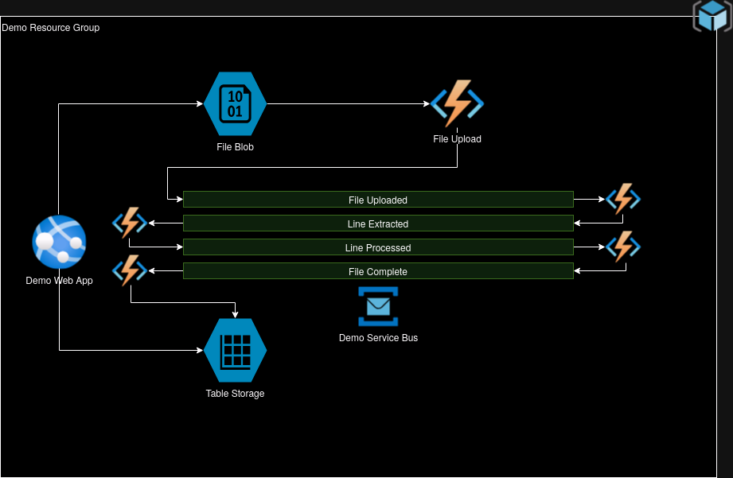

# Event Driven Demo
A Demo that demonstrates event-driven services utilizing Azure resources. To utilize this demo, you will need to have:
- Terraform >= 3.16 (Changes will need to happen if using 4.0+)
- Azure CLI
- Visual Studio or Visual Studio Code
- Azure Function Core Tools 4
- .NET 8 SDK

## How it Works
This is a simple combination of services that asyncronously picks up a file, processes it, and then outputs a different file based on the input file's contents. The processing occurs via a message-based design that uses Service Bus Topics to allow decoupled communication between different services, which execute as Azure functions. The physical view of the project is:



The file that is processed is a csv. A sample will be added as the code is written.

Note that the validation is very light on the file, so breakage may occur. Dead lettering of messages is done very easily, and retries are minimal. This goes to say that you shouldn't use this sample in production, but it will give you a good start.

## Setup
First, you must log in to your Azure account, and ensure that you are in the correct subscription that you would like to use.
```
az login
az account show
```

In order to build and deploy this demo, you will only need to run a common Terraform setup routine within the infra folder.

```
terraform init
terraform plan -out main.tfplan
terraform apply
```

This should create all Azure resources, build/deploy the site and functions, and output the address of the web app to view the results. When you are finished, simply destroy the demo to not accrue extra costs:

```
terraform destroy
```
